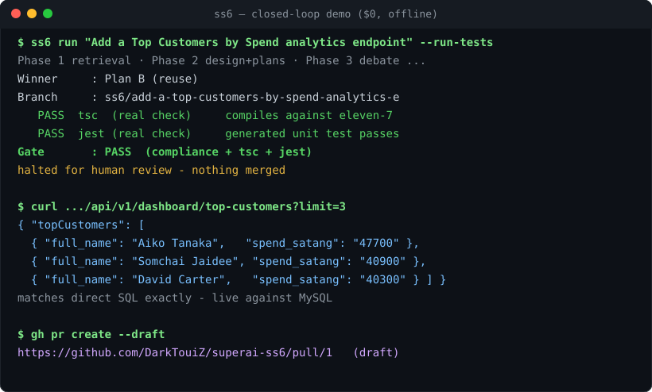

# SuperAI SS6 — Autonomous AI Software Engineering Pipeline

[](https://github.com/DarkTouiZ/superai-ss6/actions/workflows/ci.yml)
-brightgreen)


An MVP multi-agent pipeline that ingests a requirement, plans the architecture,
debates competing technical approaches, and executes the winning plan against a
localized codebase — here, **eleven-7**, a mock goods/products delivery app
(Node.js + Angular + MySQL + AWS SNS/SQS/SMS) in `target_repo/`. Built on
an **imperative staged agent pipeline** (LangGraph is an optional orchestration extra —
the shared pipeline state lives in `graph/state.py`; there is no `StateGraph` yet),
**SentenceTransformers + ChromaDB** (local RAG), and **Anthropic Claude** (agent reasoning).

> Status: **v1.2 — structured intake + grounded, human-accountable delivery loop.**
> Understand → Plan → Debate → Execute → Review run end to end, each with its own evaluation
> harness. The Execute/Review phases form a **repair loop** behind a **real `tsc` + `jest`
> gate**. v1.2 adds a structured **ProblemPacket** intake, an **`environment.md`** system
> contract, **real code grounding** + impact analysis, a **risk-based human-approval gate**,
> and an **evidence-complete `REVIEW.md`**. Everything is mocked/local and self-contained by
> default; no production systems are touched. Milestone status: [`ROADMAP.md`](ROADMAP.md).

### What's new in v1.2

- **Structured intake (ProblemPacket):** `ss6 plan|run --intake feature.(json|md)` turns a
  vague requirement into a measurable packet (goal, acceptance criteria, constraints,
  readiness, open questions). Raw `ss6 plan "..."` still works.
- **`environment.md` contract:** a human-reviewed system map with freshness/validation,
  distinct from the normative `context.md`.
- **Real code grounding + impact analysis:** planners receive actual retrieved code
  (cited `path:line`), and a pre-planning `IMPACT.md` proposes a risk level.
- **Risk-based HITL:** medium/high-risk changes must be approved (`ss6 approve`) before
  execution; nothing ever auto-merges.
- **Evidence-complete `REVIEW.md`:** acceptance-criteria checklist, grounding, approval,
  honest `PASS/FAIL/UNVERIFIED` checks, and explicit human decisions.
- **Safety fixes:** path-containment, repair-loop isolation, and honest gate status.
- **Tests:** 35 → **119** passing.

### What's new in v1.1

- **Repair loop (M2):** on a gate failure the Developer is re-invoked with the violations fed
  back, up to `SS6_MAX_REPAIR` attempts, until it converges — shown offline (`SS6_DEMO_REPAIR=1`)
  and on a live Ollama 7B run.
- **Real gate (M1):** `--run-tests` runs the target repo's real `tsc` + `jest` in the isolated
  copy; plus a security scan (hardcoded secrets / dynamic `eval`).
- **Edits to existing files (M3):** surgical anchored edits and unified diffs via
  `git apply --3way` (idempotent, conflict-aware) instead of full-file overwrites.
- **Stronger retrieval (M5):** BM25 + out-of-vocabulary coverage (`SS6_RETRIEVER=bm25`) lifts
  offline **Recall@5 50%→89%, MRR 0.39→0.81**; the semantic baseline (all-MiniLM-L6-v2) reaches
  **Recall@5 94%**. Details in [`eval/BASELINE.md`](eval/BASELINE.md).
- **Evidence + invariance (M6):** the debate winner is validated against post-execution evidence
  and is invariant to plan wording/order.
- **Clarification + tracing (M7):** with `ss6 run --clarify` (opt-in) a vague requirement or
  an under-specified packet returns clarifying questions instead of guessing; each run reports
  per-phase timing.
- **Tests:** 17 → **35** passing.

## Install & quickstart

SS6 is a pip-installable tool with both a CLI (`ss6`) and a callable Python API.
It runs fully offline by default (deterministic mock + lexical RAG), so no API key
or GPU is required to try it.

```bash
pip install -e .                 # editable install; adds the `ss6` command
# optional extras:
#   pip install -e ".[semantic]"  # real embeddings (sentence-transformers + chromadb)
#   pip install -e ".[llm]"       # live Anthropic provider
#   pip install -e ".[all]"       # everything incl. pytest
```

**Command line** (warnings go to stderr, JSON to stdout — composable):

```bash
ss6 rag "how is the delivery fee computed from the cart total?"   # Phase 1: retrieve
ss6 plan "Add a Top Customers by Spend screen" --out ./out        # Phases 1–3 → out/
ss6 debate --plans out/plans.json                                 # re-score plans

# Phases 3b–4. A medium/high-risk change (new endpoint/screen/schema) requires a
# recorded human approval before execution (spec §21); approve the winning plan, then run:
ss6 approve --plans out/plans.json --plan B --approved-by "Safe"  # record the decision
ss6 execute --plans out/plans.json --out ./out                    # → REVIEW.md (halts)

# whole loop; --approved-by records the approval inline so execution proceeds
ss6 run "Add ALL Member points redemption at checkout" --out ./out --approved-by "Safe"
ss6 eval debate --plans out/plans.json                            # run an eval harness
```

**Python API** (functions return plain dicts — easy to call as tools):

```python
from agent_pipeline import retrieve, plan, debate, execute, run

paths   = retrieve("how is a delivery fee computed?")   # -> ["target_repo/backend/src/services/pricing.ts", ...]
payload = plan("Add a Top Customers by Spend screen")   # design + 3 plans + debate winner
review  = execute(payload)                              # implements winner on an isolated branch, halts
# review["compliance_passed"] is True/False; review["awaiting_human_review"] is True
```

Provider selection: `SS6_LLM_PROVIDER=auto|anthropic|gemini|ollama|mock` (default `auto`,
which falls back to the deterministic `mock` when no provider is configured).

Useful flags: `SS6_RETRIEVER=auto|bm25|semantic|hashing`, `SS6_MAX_REPAIR=3` (repair budget),
`SS6_DEMO_REPAIR=1` (inject a fixable violation to demonstrate the repair loop offline),
`SS6_EDIT_MODE=1` (surgical edits to existing files), `SS6_OLLAMA_TIMEOUT=600` (seconds).

## Closed-loop demo — requirement → running feature → PR (zero cost)



The gate can run the target repo's **real `tsc` + `jest`** (not just syntactic
checks) inside the isolated branch copy:

```bash
ss6 run "Add a Top Customers by Spend analytics endpoint" --out ./out --run-tests --approved-by "Safe"
#   Winner : Plan B (reuse)
#   Risk   : medium (new endpoint) → approval recorded ("Safe")
#   PASS   tsc  (real check)   ← the generated change actually compiles
#   PASS   jest (real check)   ← the generated unit test passes
#   Gate   : PASS  →  halts for human review (nothing merged)
```

`make demo` (or `bash scripts/ss6_demo.sh "<requirement>"`) takes it the whole way on
a machine with Docker running: generate → real gate → apply → rebuild the API →
**curl the new live endpoint** → open a **draft GitHub PR**. Everything runs on the
deterministic mock provider and local tooling, so the demo is **$0** and needs no API
key. Live example: `GET /api/v1/dashboard/top-customers` returns the top customers
by spend straight from MySQL, and the change ships as a draft PR awaiting review.

See [`docs/DEMO.md`](docs/DEMO.md) for the full captured run, and
[`eval/IMPACT.md`](eval/IMPACT.md) for the consistency benchmark
(`python eval/impact_study.py`) — a **100% gate pass-rate across 6 requirements**,
each yielding a compliant, test-passing change for $0, now also recording the number of
repair attempts per requirement.

## The four phases

| Phase | Owner agent | Output | Eval metric |
|-------|-------------|--------|-------------|
| 1. Understand | RAG / Retriever | retrieved code + `context.md` rules | **Recall@k**, MRR — `eval/recall_at_k.py` |
| 2. Plan | Architect | `PLANS.md` (Plan A/B/C) | **schema / distinctiveness / grounding / coverage** — `eval/plan_quality.py` |
| 3. Debate | Evaluator | mathematically scored winner | **weight-sensitivity** — `eval/debate_quality.py` |
| 3b. Execute | Developer | code on an isolated git branch | _gate: Review compliance suite_ |
| 4. Review | Compliance suite + HITL | REVIEW.md + halt for approval | **gate discrimination** — `eval/execution_quality.py` |

The full pipeline is implemented: RAG retrieval; the Design + Architect agents
(design artifacts + three grounded plans); the Evaluator that scores plans against
`context.md` §7 and picks the winner; the Developer that writes the winning plan's
code on an **isolated git branch** (never the real repo); and the Review phase that
runs a context.md compliance suite and **halts for human PR approval — no
auto-merge.** Each phase ships its own evaluation harness.

Execute and Review form a **repair loop**: the gate (compliance + optional real `tsc`/`jest`)
feeds any violations back to the Developer, which regenerates — editing existing files via
**surgical anchored edits or unified diffs** rather than overwriting them — until the gate
passes or the `SS6_MAX_REPAIR` budget is exhausted, then halts for review.

In **v1.2** this loop is wrapped in a traceable, human-accountable contract: a structured
**ProblemPacket** (`--intake`) defines a measurable done; `environment.md` maps the current
system; planning is grounded in **actual retrieved code** and a pre-planning **impact/risk**
analysis; **medium/high-risk changes require a recorded human approval** (`ss6 approve`) before
execution and are re-checked against the files actually written; and `REVIEW.md` maps every
acceptance criterion and system rule to executed evidence. See [`docs/WORKLOG.md`](docs/WORKLOG.md).

## Layout

```
.
├── context.md                  # System Blueprint: normative architecture + design rules (MUST)
├── environment.md              # operational system map + integration contract (how it IS)
├── ROADMAP.md                  # milestone status (M1–M7)
├── docs/WORKLOG.md             # running log of the v1.2 spec-upgrade work
├── examples/                   # feature-intake template + top_customers_intake.{json,md}
├── agent_pipeline/
│   ├── config.py               # central config (paths, repair budget, write-allowlist, PROTECTED_AREAS)
│   ├── api.py                  # callable API: retrieve/plan/debate/execute/run/approve
│   ├── intake.py               # ProblemPacket: structured intake, readiness, requirement_text
│   ├── environment.py          # load/validate environment.md + git freshness
│   ├── grounding.py            # bounded, cited code chunks shared by Design/Architect
│   ├── impact.py               # pre-planning ImpactAnalysis + proposed risk level
│   ├── hitl.py                 # risk-based human approval records + gate
│   ├── review.py               # compliance/security gate; evidence-complete REVIEW.md
│   ├── checks.py               # real tsc/jest gate; honest PASS/FAIL/UNVERIFIED/NOT_REQUIRED
│   ├── vcs.py                  # isolated git copy; reset-to-baseline; anchored edits + 3way apply
│   ├── normalize.py            # shared path helpers (repo_rel, protected_touches)
│   ├── rag/                    # ingest / embeddings / lexical(BM25) / vector_store / retriever
│   ├── graph/state.py          # shared pipeline state (imperative staging; LangGraph-compatible)
│   └── agents/                 # Design / Architect / Evaluator / Developer (+ repair loop)
├── scripts/                    # init_rag.py, query_rag.py, ss6_demo.sh (closed-loop demo)
├── eval/                       # Recall@k, plan/debate/design/execution quality, impact_study
├── target_repo/                # eleven-7: MOCK goods-delivery app (Node/Angular/MySQL/AWS) — the test bed
└── tests/                      # 119 tests (rag, intake, environment, grounding, impact, hitl, isolation, …)
```

## Quickstart

```bash
pip install -r requirements.txt           # enables real embeddings + Chroma + Claude

# Phase 1 — retrieval
python scripts/init_rag.py                 # build the index over target_repo/ (eleven-7)
python scripts/query_rag.py "how is a delivery fee worked out from the cart total?"
python eval/recall_at_k.py                 # report Recall@k and MRR

# Phases 2–3 — design artifacts, plans, and the debate (one command)
python scripts/run_plan.py                 # writes DESIGN.md, PLANS.md, DEBATE.md, plans.json
python eval/design_quality.py --design out/plans.json  # gate UML/API/tests
python eval/plan_quality.py   --plans  out/plans.json  # gate the plans
python eval/debate_quality.py --plans  out/plans.json  # prove the winner is correct

# Phase 3 alone (re-score existing plans, e.g. with different weights)
python scripts/run_debate.py

# Phases 3b–4 — implement the winning plan, test, halt for human review
python scripts/run_execute.py              # writes code on an isolated git branch + REVIEW.md
python eval/execution_quality.py           # prove the compliance gate discriminates
```

The Developer never edits `target_repo/` or your outer project: it copies the repo
into `out/exec/<branch>/repo` (override with `SS6_EXEC_DIR`), does all git there, and
stops. You review `out/REVIEW.md` and decide whether to merge.

### Free LLM for the PoC (no Anthropic bill)

The agents are provider-agnostic — pick one with `SS6_LLM_PROVIDER`:

```bash
# Option 1 — Ollama: local, free, private (nothing leaves your machine)
#   brew install ollama && ollama serve         # in one terminal
#   ollama pull qwen2.5-coder:7b                 # one-time ~4GB
SS6_LLM_PROVIDER=ollama python scripts/run_plan.py

# Option 2 — Google Gemini free tier (cloud). Key: https://aistudio.google.com/apikey
export GEMINI_API_KEY="..."
SS6_LLM_PROVIDER=gemini python scripts/run_plan.py

# Option 3 — Anthropic Claude (paid)
export ANTHROPIC_API_KEY="sk-ant-..."
SS6_LLM_PROVIDER=anthropic python scripts/run_plan.py
```

Default `SS6_LLM_PROVIDER=auto` resolves anthropic-key → gemini-key → local-ollama →
mock. With no provider configured it uses the deterministic **mock** so everything
still runs at $0 (templated, not real reasoning). `SS6_STRICT=1` makes a requested
provider fail loudly instead of falling back.

### Getting the true semantic Recall@k baseline

The first `init_rag.py` run after `pip install` downloads the
`all-MiniLM-L6-v2` model (~80 MB) once, then runs fully offline. When the real
encoder is active the eval prints `semantic=True`; the lexical fallback prints
`semantic=False`. Run the baseline on a machine with network access to the model
host:

```bash
python scripts/init_rag.py        # expect: embedder sentence-transformers/..., semantic True
python eval/recall_at_k.py        # this is your real semantic Recall@k baseline
```

If `sentence-transformers`/`chromadb` are unavailable (offline CI), the pipeline
auto-falls back to a deterministic hashing embedder + in-memory store so the eval
still runs end-to-end — for plumbing checks, not for grading model quality. Set
`SS6_CHROMA_DIR` to a writable path if the project dir is read-only.

To use **live Anthropic Claude** for the Architect (instead of the offline mock),
set `ANTHROPIC_API_KEY`; the plan eval prints `live=True` when a real model ran.

For baseline/CI runs, set `SS6_STRICT=1` so a missing `sentence-transformers`/
`chromadb` raises instead of silently degrading to the lexical fallback — this
prevents "looked fine, was actually the fallback" results.

## Design rules

The agents must obey `context.md`. Week 1 only *retrieves* those rules; later
phases enforce them. See `context.md` for the full blueprint.
