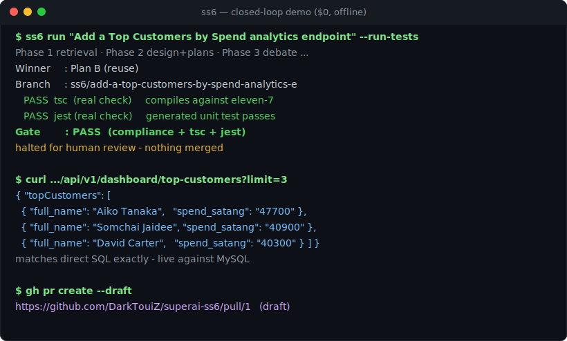

# Closed-loop demo — requirement → running feature → PR ($0)

This is a real, captured run on a developer machine (Docker + MySQL + LocalStack),
using the **deterministic mock provider** and **local `tsc`/`jest`** — no API key,
no cloud, **$0**.



## 1. One command

```bash
ss6 run "Add a Top Customers by Spend analytics endpoint" --out ./out --run-tests
```

```text
Winner     : Plan B (reuse)
Branch     : ss6/add-a-top-customers-by-spend-analytics-e
   PASS     tsc (real check)      ← the generated change actually compiles
   PASS     jest (real check)     ← the generated unit test passes
Gate       : PASS                 ← context.md compliance + tsc + jest
⏸  Halted for human review. Artifacts in out/ — nothing merged.
```

SS6 planned three approaches, the deterministic Evaluator chose **Plan B (reuse)**,
and the Developer wrote a **real multi-file backend slice**:

```
backend/src/services/analytics.ts              (pure, unit-tested)
backend/src/repositories/analyticsRepository.ts
backend/src/controllers/analyticsController.ts
backend/src/services/__tests__/analytics.test.ts
backend/src/routes/index.ts                    (route registered)
```

The Review gate ran the repo's **own** TypeScript compiler and Jest suite inside an
isolated branch copy — so "looks compliant" became "actually compiles and its tests
pass."

## 2. Apply + rebuild + hit the new live endpoint

```bash
GET /api/v1/dashboard/top-customers?limit=5
```

```json
{
  "topCustomers": [
    { "customer_id": 12, "full_name": "Aiko Tanaka",   "loyalty_tier": "platinum", "spend_satang": "47700" },
    { "customer_id": 1,  "full_name": "Somchai Jaidee", "loyalty_tier": "gold",     "spend_satang": "40900" },
    { "customer_id": 3,  "full_name": "David Carter",   "loyalty_tier": "platinum", "spend_satang": "40300" }
  ]
}
```

The values match a direct SQL aggregate exactly (Aiko ฿477.00, Somchai ฿409.00,
David ฿403.00) — the feature is genuinely live against MySQL.

## 3. Ships as a draft PR (human-in-the-loop)

The change is pushed to a feature branch and opened as a **draft pull request**,
halted for human approval — nothing is auto-merged:
[`DarkTouiZ/superai-ss6#1`](https://github.com/DarkTouiZ/superai-ss6/pull/1).

## Reproduce it

```bash
make up        # start the eleven-7 stack (Docker)
make demo      # generate → real gate → apply → rebuild → curl → draft PR
```

Everything above is the deterministic mock provider plus local tooling, so it runs
**for free and offline**. Point `SS6_LLM_PROVIDER` at a live model to swap in real
reasoning without changing the workflow.
