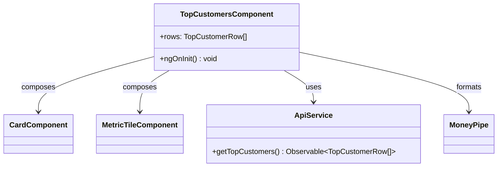

# DESIGN.md — design artifacts

**Requirement:** Add a Top Customers by Spend analytics endpoint

_Generated by `mock` (deterministic mock)._

## UML

## API / interface spec

- `ApiService.getTopCustomers(): Observable<TopCustomerRow[]>`
- `GET /api/v1/dashboard/top-customers -> { rows: TopCustomerRow[] }`
- `interface TopCustomerRow { customer_id: number; full_name: string; spend_satang: number }`
- `TopCustomersComponent.ngOnInit(): void`

## Test cases

- **[functional]** renders one Card per customer with spend formatted by MoneyPipe
- **[functional]** sorts customers by total spend descending
- **[non_functional]** empty state shows a message, does not crash (context.md §6)
- **[non_functional]** spend totals use integer satang, no float drift (context.md §4/§5)
- **[non_functional]** data fetched only via ApiService, not HttpClient/fetch (context.md §4)
- **[functional]** interactive elements carry an aria-label (context.md §6)

## Adherence notes

- **UX:** Compose canonical primitives; reference tokens.scss CSS variables only; no inline hex.
- **Architecture:** Aggregation in a backend service/repository; component fetches via ApiService only.

**Primitives reused:** avatar, badge, button, card, metric-tile

**Services used:** target_repo/backend/src/services/promotionService.ts, target_repo/backend/node_modules/zod/v4/classic/errors.js
